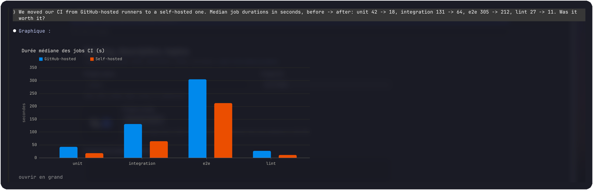
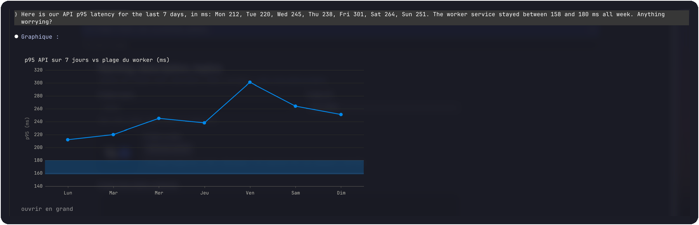
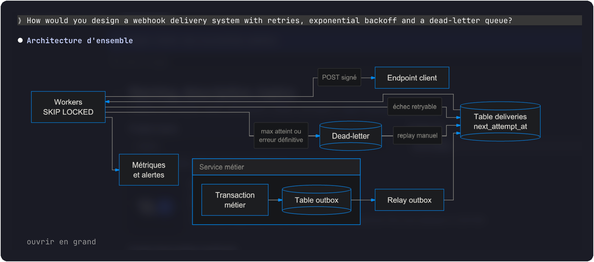
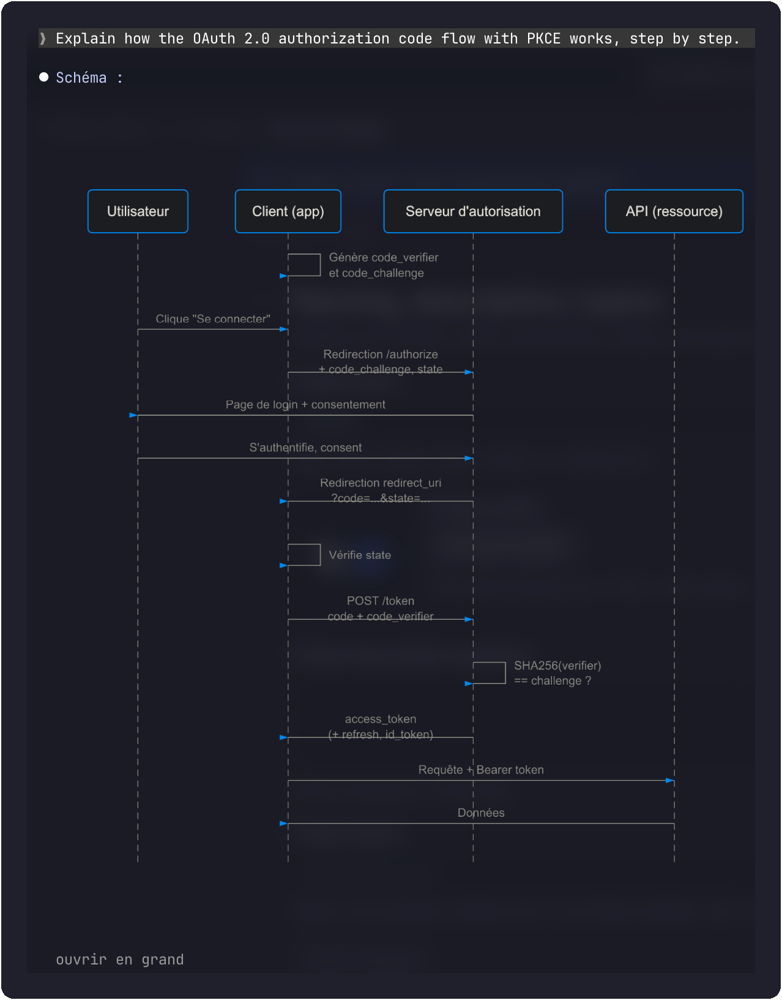
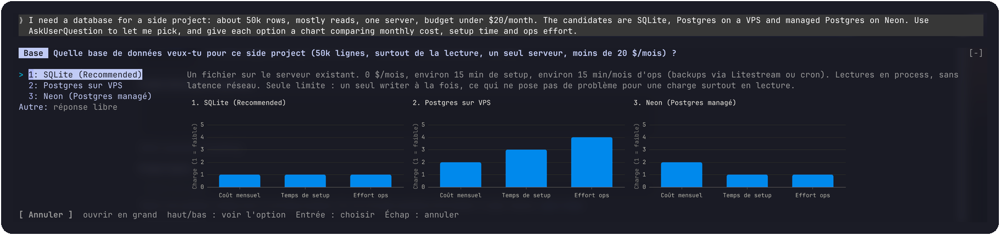
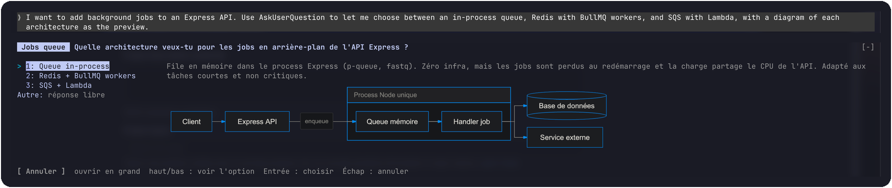
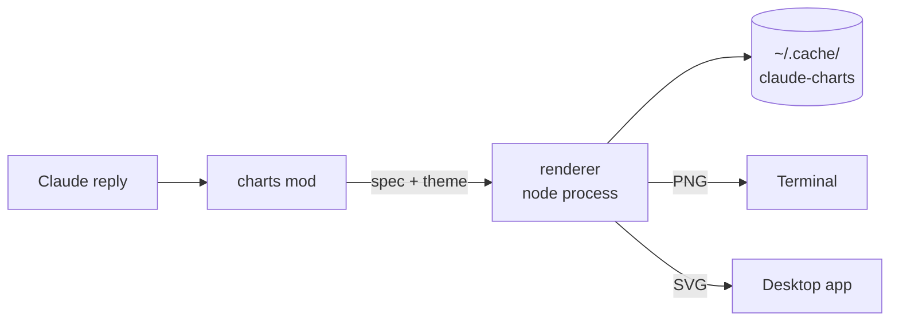

<div align="center">

<picture>
  <source media="(prefers-color-scheme: dark)" srcset="assets/logo/charts-logo-dark.svg">
  <source media="(prefers-color-scheme: light)" srcset="assets/logo/charts-logo-light.svg">
  
</picture>

[](LICENSE)
[](https://code.claude.com/docs)
[](https://nodejs.org/)

**Charts and diagrams in Claude Code, drawn as images instead of code blocks.**

[Install](#install) |
[What it draws](#what-it-draws) |
[Usage](#usage) |
[How it works](#how-it-works) |
[Development](#development)

</div>

---

## What is charts?

I got tired of reading Vega-Lite JSON in my terminal, so I wrote a mod that draws it.

charts is a Claude Code mod. When Claude writes a ` ```vega-lite `, ` ```mermaid ` or ` ```dot `
block, the mod replaces it with the picture: a PNG in the terminal, an SVG in the desktop app. The
stored message still holds the source, so Claude keeps reading the data, not the image.

It also nudges Claude to draw more. Ask for a comparison and you get a bar chart. Ask how a system
works and you get a diagram first, then the parts the diagram can't say.

<div align="center">
  
</div>

## Install

You need:

- Claude Code 2.1.280 or newer
- Node 20 or newer on your `PATH`
- For images in the terminal, a terminal with the kitty graphics protocol, such as
  [Ghostty](https://ghostty.org) or [kitty](https://sw.kovidgoyal.net/kitty/). Other terminals show
  the chart's text description instead.

### 1. Turn on function hooks

Mods are still early access, so Claude Code only loads them with this variable set. Add it to
`~/.claude/settings.json`:

```json
{
  "env": { "CLAUDE_CODE_ENABLE_FUNCTION_HOOKS": "1" }
}
```

### 2. Add the marketplace and install

```bash
claude plugin marketplace add https://gitlab.com/ThomasTartrau/charts.git
claude plugin install charts@tartrau-mods
```

From inside a session, `/plugin marketplace add` and `/plugin install` do the same thing.

Claude Code installs the renderer's npm dependencies during the install. Start a new session and
ask something with numbers in it.

### Updating

```bash
claude plugin update charts
```

## What it draws

### Charts in replies

Any ` ```vega-lite ` block, with the mod's theme and a size that fits the terminal.

<div align="center">
  
</div>

### Diagrams

` ```mermaid ` flowcharts, sequence, state, class and ER diagrams, and ` ```dot ` graphs.
Mermaid `pie` and `gantt` blocks are turned into Vega-Lite charts so they share the same theme.

<div align="center">
  
  <br><br>
  
</div>

### Options you can compare

When Claude asks you to pick between options (AskUserQuestion) and each one comes with a chart,
charts merges them into one image with a shared scale. Three bars of different heights mean something
again. The question moves to the band above the prompt, with the image next to the options.

<div align="center">
  
</div>

Options that are designs rather than numbers get a diagram each. The image follows the option you
move to.

<div align="center">
  
</div>

Every image has an "ouvrir en grand" button that opens a full-size PNG in your image viewer.

## Usage

Nothing to call. Ask a question where a chart would help and Claude draws one.

The `/charts` command shows and changes the settings. They are kept across sessions.

| Command | Effect |
|---|---|
| `/charts` | Show the current settings |
| `/charts on` / `off` | Turn the mod on or off |
| `/charts theme dark` / `light` | Match your terminal's background |
| `/charts width <20-255>` | Maximum chart width, in terminal columns (default 100) |
| `/charts rows <3-80>` | Maximum chart height, in terminal rows (default 22) |
| `/charts cell <0.3-0.8>` | Width/height ratio of a terminal cell (default 0.5) |
| `/charts reset` | Back to the defaults |

## How it works



- `hooks/` is the mod: TypeScript hooks that Claude Code loads. It finds chart blocks in each
  reply, draws them, adds a short guide to the system prompt, and handles AskUserQuestion.
- `renderer/` is a small Node script built on [Vega-Lite](https://vega.github.io/vega-lite/),
  [beautiful-mermaid](https://github.com/lukilabs/beautiful-mermaid),
  [Viz.js](https://github.com/mdaines/viz-js) (Graphviz) and
  [resvg](https://github.com/yisibl/resvg-js). The mod starts it once per image.
- Rendered images are cached in `~/.cache/claude-charts`, keyed by a hash of the spec. Scrolling back
  over an old chart doesn't start Node again.

When a block can't be drawn, usually an invalid spec, you get the source back with the error under it.

## Development

Load the folder straight from disk, without installing it:

```bash
claude --plugin-dir /path/to/charts
```

A `--plugin-dir` copy takes priority over an installed copy with the same name.

```bash
npm install                          # renderer dependencies
claude plugin validate .             # manifest and hooks module
claude plugin test .                 # mod tests (tests/*.test.ts)
npm test                             # renderer tests
```

## License

[MIT](LICENSE)
